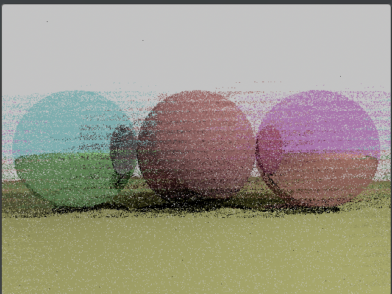
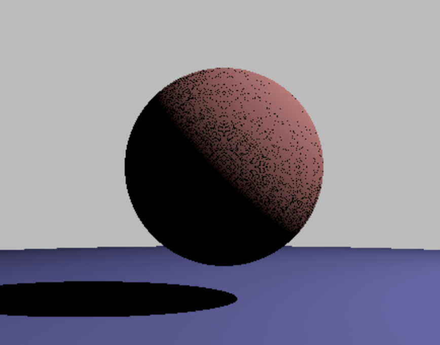

1) Generally works, but there are still some bugs that I want to iron out. (Development process can be found in the associated [project](https://github.com/users/jphung101/projects/1))
2) Here are some interesting bugs that I came across during developement and managed to solve:
# Scattering

# Shadow Acne
 

